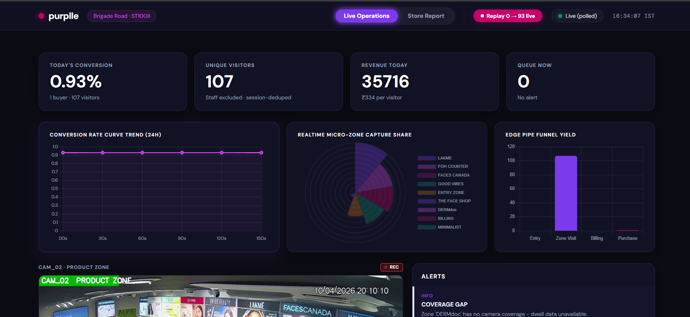
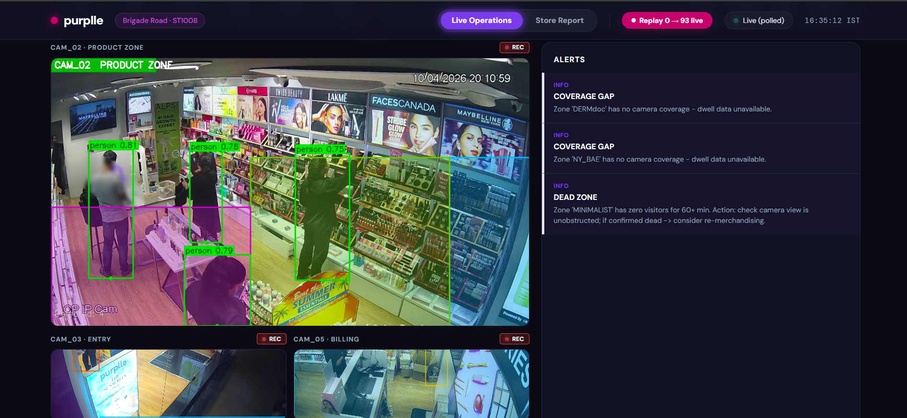
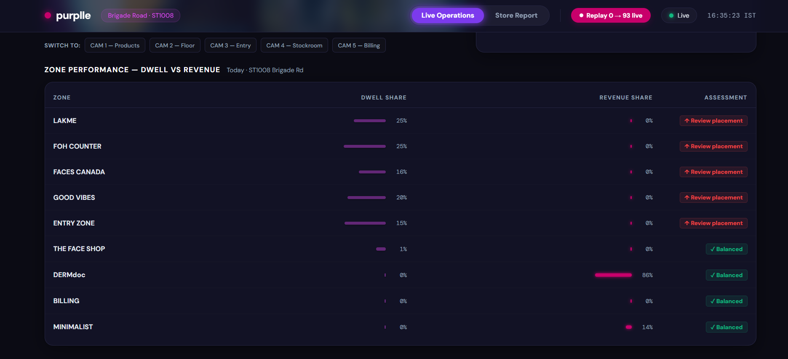
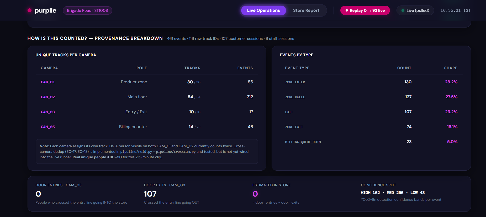
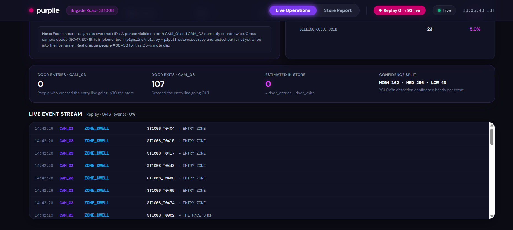

# RetailVisionAI 🛍️📹

AI-powered retail intelligence platform that transforms CCTV footage into actionable business insights using computer vision, visitor tracking, session analytics, POS correlation, and real-time dashboards.

---

## Overview

RetailVisionAI helps physical retail stores understand customer behavior in the same way e-commerce platforms understand online shoppers.

Using existing CCTV infrastructure, the system can:

- Detect and track customers in real time
- Measure visitor traffic and dwell time
- Analyze customer journeys through store zones
- Calculate conversion rates
- Correlate store visits with POS transactions
- Detect operational anomalies
- Generate actionable dashboards and reports

---

## Key Features

### Computer Vision Pipeline

- YOLOv8 person detection
- ByteTrack multi-object tracking
- Cross-camera visitor continuity
- Re-identification for customer re-entry
- Staff vs customer classification
- Zone-based dwell analytics

### Retail Analytics

- Unique visitor counting
- Conversion rate calculation
- Revenue attribution
- Customer journey funnel
- Zone performance heatmaps
- Queue monitoring
- Dead-zone detection
- Conversion-drop alerts

### Dashboard

- Live CCTV stream overlays
- Real-time KPI cards
- Interactive analytics charts
- Conversion funnel visualization
- Heatmap insights
- Alert management
- Exportable reports

### Engineering Features

- FastAPI backend
- SQLite persistence layer
- Docker deployment
- REST APIs
- Server-Sent Events (SSE)
- Automated testing
- Configurable store layouts

---

### Dashboard Overview



### Live CCTV Analytics



### Conversion Analytics



### Customer Journey Funnel



### Zone Performance Analytics



## Architecture

```text
CCTV Cameras
      │
      ▼
YOLOv8 Detection
      │
      ▼
ByteTrack Tracking
      │
      ▼
Event Generation
      │
      ▼
FastAPI Ingestion API
      │
      ▼
SQLite Database
      │
      ▼
Analytics Engine
      │
      ▼
Real-Time Dashboard
```

---

## Tech Stack

### Backend

- FastAPI
- Pydantic
- Uvicorn

### Computer Vision

- YOLOv8
- ByteTrack
- OpenCV
- NumPy

### Analytics

- Pandas
- SQLite

### Deployment

- Docker
- Docker Compose

---

## Project Structure

```text
RetailVisionAI/
│
├── app/                 # FastAPI backend
├── pipeline/            # Detection & tracking pipeline
├── scripts/             # Utility scripts
├── config/              # Store configuration
├── data/                # CCTV footage & POS data
├── tests/               # Automated tests
├── docs/                # Design documentation
│
├── Dockerfile
├── docker-compose.yml
├── requirements.txt
└── README.md
```

---

## Quick Start

### Option 1: Docker

```bash
git clone <repo-url>
cd RetailVisionAI

docker compose up --build
```

Open:

```text
http://localhost:8000
```

API Docs:

```text
http://localhost:8000/docs
```

---

### Option 2: Local Development

Create virtual environment:

```bash
python -m venv venv
```

Activate:

```bash
# Windows
venv\Scripts\activate

# Linux/Mac
source venv/bin/activate
```

Install dependencies:

```bash
pip install -r requirements.txt
```

Run API:

```bash
uvicorn app.main:app --reload
```

Open:

```text
http://localhost:8000
```

---

## Running the CCTV Pipeline

Start the API first:

```bash
uvicorn app.main:app --reload
```

Then process CCTV footage:

```bash
python scripts/run_pipeline.py --api http://127.0.0.1:8000
```

The pipeline will:

1. Read CCTV footage
2. Detect people using YOLOv8
3. Track visitors using ByteTrack
4. Generate events
5. Send events to the API
6. Update dashboard metrics

---

## Core Metrics

### Conversion Rate

```text
Conversion Rate =
Number of Buyers
────────────────────────
Unique Non-Staff Visitors
```

### Additional Metrics

- Unique Visitors
- Buyers
- Revenue
- Revenue per Visitor
- Queue Depth
- Abandonment Rate
- Zone Dwell Time
- Funnel Drop-Off
- Attention vs Sales Gap

---

## API Endpoints

| Endpoint                 | Description           |
| ------------------------ | --------------------- |
| `/health`                | Service health status |
| `/events/ingest`         | Event ingestion       |
| `/stores/{id}/metrics`   | Store KPIs            |
| `/stores/{id}/funnel`    | Conversion funnel     |
| `/stores/{id}/heatmap`   | Zone analytics        |
| `/stores/{id}/anomalies` | Operational alerts    |
| `/stream/{camera}`       | Live CCTV stream      |
| `/api/live`              | Real-time SSE updates |

Interactive API documentation:

```text
http://localhost:8000/docs
```

---

## Testing

Run all tests:

```bash
pytest
```

Run with coverage:

```bash
pytest --cov=app --cov=pipeline
```

---

## Design Principles

### Event-Driven Architecture

Raw events are stored as the source of truth and sessions are derived dynamically.

### Session-Centric Analytics

All business metrics are calculated from visitor sessions rather than raw detections.

### Deployment Simplicity

The system is designed to run with minimal setup using Docker Compose.

### Extensibility

The repository layer allows future migration from SQLite to PostgreSQL with minimal changes.

---

## Future Enhancements

- Multi-store analytics
- Advanced customer segmentation
- Product recommendation insights
- Forecasting models
- Mobile dashboard
- Cloud deployment support
- Advanced cross-camera re-identification

---

## License

This project was developed as part of a retail analytics and computer vision challenge.

---

## Authors

Built using:

- FastAPI
- YOLOv8
- ByteTrack
- OpenCV
- SQLite
- Docker

Transforming CCTV footage into business intelligence.
